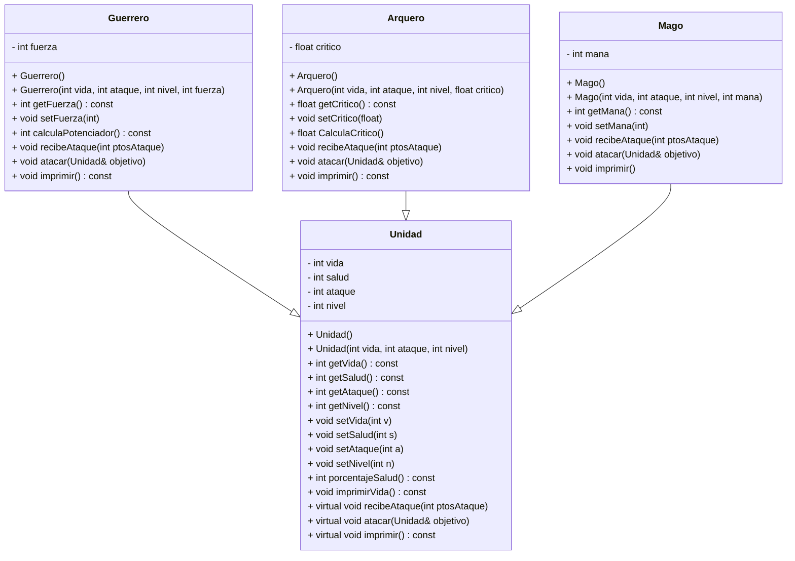

# Alumno: Adolfo Rodríguez Rodríguez - A01739189  
## TC1030.851

## Introducción

La situación problema plantea el desarrollo de un código en C++ para llevar a cabo la ejecución de un juego tipo RPG, usando programación orientada a objetos. En el caso de mi proyecto, decidí apegarme bastante a las sugerencias que las tareas daban respecto a la elaboración del código, pues me falta un poco de creatividad.

A continuación se destacarán elementos importantes sobre la elaboración del juego que respaldan el uso de la programación orientada a objetos.

---

### Herencia

Dentro de la clase base `Unidad`, las demás clases hijas pueden usar métodos y atributos gracias a la herencia. En este caso, heredan atributos como la vida, el ataque y el nivel.

---

### Polimorfismo

El uso del polimorfismo está bastante presente. Hay métodos virtuales en la clase `Unidad` que se van sobreescribiendo en las clases derivadas. También se almacenan objetos de diferentes tipos (Guerrero, Arquero, Mago) en los vectores de punteros dentro del archivo `exercise`.

---

### Clases abstractas

En `Unidad`, al haber declarado funciones como virtuales puras, se convierte en una clase abstracta. Esto impide instanciar directamente objetos de esta clase y obliga a las clases derivadas a implementar las funciones puras.

---

### Sobrecarga de operadores

El operador que utilicé fue `<<`, que me permite imprimir objetos de tipo `Unidad` (y por ende de tipo `Guerrero`, `Mago`, y `Arquero`) directamente con `cout`, como si fueran tipos de datos básicos.

---

### Excepciones

Para esto, creé un nuevo archivo donde definí una excepción personalizada (`ArgumentoInvalido`). Esta tiene como función validar que los datos cargados desde el archivo `.txt` sean válidos para crear los objetos. Al cargar estos datos, hay un bloque `try` que se encarga de lanzar la excepción en caso de ser necesario.

---

## Experiencia

En general, mi experiencia con este proyecto fue divertida, aunque me costó mucho. Hay cosas que todavía me cuesta razonar, incluso detalles tontos como olvidar un `;` o errores de lógica sencillos. Sin embargo, pude entender todos los temas que se presentaron en el curso. Estoy satisfecho con lo que hice y agradezco al profesor por su forma de trabajo.

---

**No usé referencias.**

