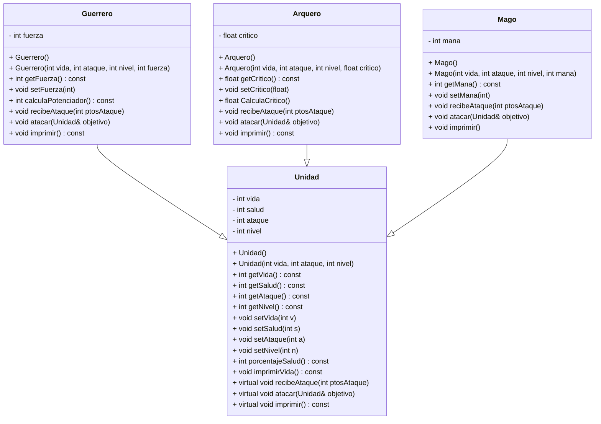

```mermaid
classDiagram
    class Unidad {
        - int vida
        - int salud
        - int ataque
        - int nivel
        + Unidad()
        + Unidad(int vida, int ataque, int nivel)
        + int getVida() const
        + int getSalud() const
        + int getAtaque() const
        + int getNivel() const
        + void setVida(int v)
        + void setSalud(int s)
        + void setAtaque(int a)
        + void setNivel(int n)
        + int porcentajeSalud() const
        + void imprimirVida() const
        + virtual void recibeAtaque(int ptosAtaque)
        + virtual void atacar(Unidad& objetivo)
        + virtual void imprimir() const
    }

    class Guerrero {
        - int fuerza
        + Guerrero()
        + Guerrero(int vida, int ataque, int nivel, int fuerza)
        + int getFuerza() const
        + void setFuerza(int)
        + int calculaPotenciador() const
        + void recibeAtaque(int ptosAtaque)
        + void atacar(Unidad& objetivo)
        + void imprimir() const
    }

    class Arquero {
        - float critico
        + Arquero()
        + Arquero(int vida, int ataque, int nivel, float critico)
        + float getCritico() const
        + void setCritico(float)
        + float CalculaCritico()
        + void recibeAtaque(int ptosAtaque)
        + void atacar(Unidad& objetivo)
        + void imprimir() const
    }

    class Mago {
        - int mana
        + Mago()
        + Mago(int vida, int ataque, int nivel, int mana)
        + int getMana() const
        + void setMana(int)
        + void recibeAtaque(int ptosAtaque)
        + void atacar(Unidad& objetivo)
        + void imprimir()
    }

    Guerrero --|> Unidad
    Arquero --|> Unidad
    Mago --|> Unidad
```
